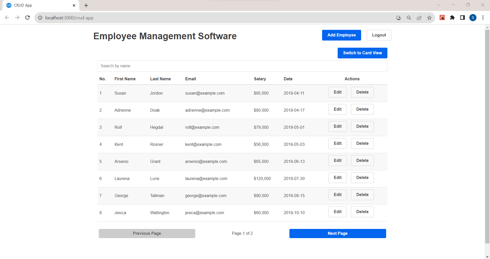

# React CRUD App

<p align="center">
  A simple and beautiful <a href="https://www.codecademy.com/articles/what-is-crud">CRUD</a> application built with <a href="https://reactjs.org">React</a>.
</p>




## Technologies Used

- [React](http://reactjs.org)
- [Primitive UI](https://taniarascia.github.io/primitive)
- [SweetAlert2](https://sweetalert2.github.io)

## New Features

These new features were added.

1. Global search
2. UI design changes
3. Pagination
4. Navigation bar
5. Switch between table and card view

## Development

### Getting Started

1. To get a local copy of the code, clone it using git:
   ```bash
   git clone https://github.com/devadigax/react-crud-app.git
   cd react-crud-app
   
2. Install dependencies:
   ```bash
   npm install
   
3. Now, you can start a local web server by running:
   ```bash
   npm start
   
4. and then you can open http://localhost:3000 to view it in the browser.
   
6. Available Scripts
   - Builds the app for production to the build folder.
     ```bash
     npm run build
     
   - This command will remove the single build dependency from your project.
     ```bash
     npm run eject
     

### Credits
This is a modified version of the CRUD App originally built by [Safdar Jamal](https://github.com/SafdarJamal/crud-app).

### License
CRUD App is open-source software licensed under the MIT License.

